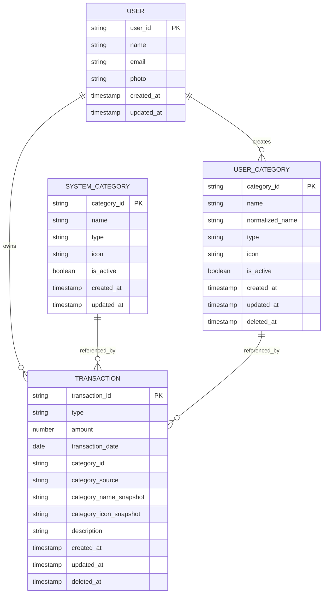

# Firestore ERD & Data Model
## Personal Finance Tracker — MVP

**Version:** 1.0  
**Status:** Proposed  
**Database:** Cloud Firestore  
**Authentication:** Firebase Authentication — Google  
**Frontend:** React JS  
**Currency:** IDR only

---

# 1. Architecture Decision

Cloud Firestore is a document database rather than a relational database, so the ERD below should be interpreted as a **logical data model**, while the actual implementation uses collections, documents, and subcollections.

For this application, the recommended structure is:

```text
users/{userId}
    ├── transactions/{transactionId}
    └── categories/{categoryId}

system_categories/{categoryId}
```

This structure is preferred because:

- user-owned data is naturally scoped under the authenticated user's document;
- security rules can enforce ownership at the path level;
- transactions and categories grow independently as subcollections;
- we avoid embedding growing transaction arrays inside a user document;
- Firestore supports hierarchical documents/subcollections and cursor-based queries for pagination.

---

# 2. High-Level ERD



---

# 3. Important Firestore Concept

Unlike SQL:

```text
Transaction
    JOIN Category
```

is not the preferred pattern in Firestore.

Therefore, each transaction should store both:

```text
category_id
category_source
```

and a small snapshot:

```text
category_name
category_icon
```

For example:

```json
{
  "category_id": "food",
  "category_source": "system",
  "category_name": "Food",
  "category_icon": "utensils"
}
```

This is deliberate denormalization.

It means the transaction can render:

```text
Food
🍴
```

without requiring another database read for every transaction.

It also preserves historical presentation when a custom category is later soft-deleted.

Firestore documentation explicitly allows denormalized data structures and recommends choosing structures based on query/read patterns rather than forcing relational normalization.

---

# 4. Firestore Physical Structure

The recommended production structure is:

```text
firestore
│
├── users
│   └── {userId}
│       │
│       ├── profile fields
│       │
│       ├── transactions
│       │   └── {transactionId}
│       │
│       └── categories
│           └── {categoryId}
│
└── system_categories
    └── {categoryId}
```

---

# 5. Collection: users

## Path

```text
users/{userId}
```

The `userId` should be the Firebase Authentication UID.

Example:

```text
users/
    qJ3hK8L9pX2...
```

Using the authentication UID as the document ID is preferable because there is a direct mapping between the authenticated identity and the Firestore document.

## Schema

```text
users/{userId}
```

| Field | Type | Required | Description |
|---|---|---:|---|
| `name` | string | Yes | Display name from Google profile |
| `email` | string | Yes | Authenticated email |
| `photo` | string | No | Google profile photo URL |
| `created_at` | timestamp | Yes | Profile creation time |
| `updated_at` | timestamp | Yes | Last profile update |

### Example

```json
{
  "name": "Ega",
  "email": "user@example.com",
  "photo": "https://...",
  "created_at": "Timestamp",
  "updated_at": "Timestamp"
}
```

---

# 6. Collection: transactions

## Path

```text
users/{userId}/transactions/{transactionId}
```

This collection contains all transactions belonging to a single user.

A transaction must never be stored in another user's transaction subcollection.

## Schema

| Field | Type | Required | Description |
|---|---|---:|---|
| `type` | string | Yes | `income` or `expense` |
| `amount` | number | Yes | Positive transaction amount |
| `transaction_date` | timestamp/date | Yes | Date transaction occurred |
| `category_id` | string | Yes | Category identifier |
| `category_source` | string | Yes | `system` or `user` |
| `category_name` | string | Yes | Denormalized category name snapshot |
| `category_icon` | string | Yes | Denormalized category icon snapshot |
| `description` | string | No | Optional description |
| `created_at` | timestamp | Yes | Creation timestamp |
| `updated_at` | timestamp | Yes | Last modification timestamp |
| `deleted_at` | timestamp/null | Yes | Soft-delete timestamp |

---

# 7. Transaction Example

```json
{
  "type": "expense",
  "amount": 50000,

  "transaction_date": "2026-08-17",

  "category_id": "food",
  "category_source": "system",

  "category_name": "Food",
  "category_icon": "utensils",

  "description": "Lunch",

  "created_at": "Timestamp",
  "updated_at": "Timestamp",

  "deleted_at": null
}
```

---

# 8. Transaction Rules

## 8.1 Type

Allowed values:

```text
income
expense
```

No other values should be accepted.

---

## 8.2 Amount

Must satisfy:

```text
amount > 0
```

Never store expenses as negative numbers.

Correct:

```json
{
  "amount": 50000,
  "type": "expense"
}
```

Incorrect:

```json
{
  "amount": -50000,
  "type": "expense"
}
```

---

## 8.3 Transaction Date

The application must reject:

```text
transaction_date > current_date
```

Past and current dates are allowed.

---

## 8.4 Category Compatibility

The transaction category must have the same type:

```text
transaction.type == category.type
```

Example:

```text
transaction.type = expense
category.type = expense
```

Valid.

While:

```text
transaction.type = expense
category.type = income
```

is invalid.

---

# 9. Why `category_source` Exists

A transaction may point to either:

```text
system category
```

or:

```text
user category
```

Therefore:

```text
category_source = "system"
```

means:

```text
system_categories/{category_id}
```

while:

```text
category_source = "user"
```

means:

```text
users/{userId}/categories/{category_id}
```

This gives the application an explicit way to determine the category origin.

---

# 10. Why Category Snapshot Exists

Consider:

```text
User creates:

Category:
Gaming

Transaction:
Rp100.000
Gaming
```

Later:

```text
Gaming category
→ soft deleted
```

The transaction must still display:

```text
Gaming
Rp100.000
```

Therefore the transaction stores:

```text
category_id
category_name
category_icon
```

This avoids a dependency on the category document remaining active.

It also eliminates a large number of additional document reads when rendering a transaction list.

---

# 11. Collection: system_categories

## Path

```text
system_categories/{categoryId}
```

This contains global application-provided categories.

These categories are available to all authenticated users.

## Schema

| Field | Type | Required | Description |
|---|---|---:|---|
| `name` | string | Yes | Display name |
| `type` | string | Yes | `income` / `expense` |
| `icon` | string | Yes | Application-provided icon identifier |
| `is_active` | boolean | Yes | Whether the category is available |
| `created_at` | timestamp | Yes | Creation timestamp |
| `updated_at` | timestamp | Yes | Last update timestamp |

---

# 12. Example System Categories

```json
{
  "salary": {
    "name": "Salary",
    "type": "income",
    "icon": "wallet"
  },

  "business": {
    "name": "Business",
    "type": "income",
    "icon": "briefcase"
  },

  "bonus": {
    "name": "Bonus",
    "type": "income",
    "icon": "gift"
  },

  "food": {
    "name": "Food",
    "type": "expense",
    "icon": "utensils"
  },

  "transportation": {
    "name": "Transportation",
    "type": "expense",
    "icon": "car"
  },

  "shopping": {
    "name": "Shopping",
    "type": "expense",
    "icon": "shopping-bag"
  }
}
```

For system categories, deterministic IDs such as:

```text
food
salary
shopping
transportation
```

are appropriate because these are stable application-defined identifiers rather than user-generated sequential IDs.

For user-generated documents such as transactions, Firestore-generated random IDs are preferable to monotonically increasing IDs because sequential IDs can create hotspotting under high write rates.

---

# 13. Collection: User Categories

## Path

```text
users/{userId}/categories/{categoryId}
```

This collection contains custom categories created by the user.

## Schema

| Field | Type | Required | Description |
|---|---|---:|---|
| `name` | string | Yes | Category display name |
| `normalized_name` | string | Yes | Normalized value used for uniqueness |
| `type` | string | Yes | `income` / `expense` |
| `icon` | string | Yes | Application-provided icon |
| `is_active` | boolean | Yes | Active/inactive |
| `created_at` | timestamp | Yes | Creation timestamp |
| `updated_at` | timestamp | Yes | Last update timestamp |
| `deleted_at` | timestamp/null | Yes | Soft-delete timestamp |

---

# 14. Category Uniqueness

Firestore does not provide a traditional SQL-style:

```sql
UNIQUE(user_id, type, name)
```

constraint.

Therefore, uniqueness must be designed into the Firestore model.

Recommended approach:

```text
category_id =
    {type}_{normalized_name}
```

Example:

```text
expense_food
expense_gaming
expense_coffee

income_freelance
income_bonus
```

This makes the logical uniqueness:

```text
user + type + normalized_name
```

naturally represented by the document path.

Example:

```text
users/U123/categories/expense_coffee
```

A normalized name should be generated consistently, for example:

```text
"Coffee"
"coffee"
" COFFEE "
```

all normalize to a single canonical key:

```text
coffee
```

This prevents duplicate categories caused by capitalization or accidental whitespace.

---

# 15. Category Example

```json
{
  "name": "Gaming",
  "normalized_name": "gaming",
  "type": "expense",
  "icon": "gamepad",
  "is_active": true,

  "created_at": "Timestamp",
  "updated_at": "Timestamp",

  "deleted_at": null
}
```

---

# 16. Soft Delete Model

Both transactions and custom categories support soft deletion.

## Active

```text
deleted_at = null
```

## Deleted

```text
deleted_at = Timestamp
```

The application should consistently query:

```text
deleted_at == null
```

for active records.

A soft-deleted category:

```text
users/U123/categories/expense_gaming
```

must not be available for new transactions.

However, existing transactions keep:

```text
category_id
category_name
category_icon
```

so historical records remain readable.

---

# 17. Relationship Model

Although Firestore is not relational, the logical relationships are:

```text
USER
  │
  ├──────── owns ────────> TRANSACTION
  │
  └──────── creates ─────> USER_CATEGORY


SYSTEM_CATEGORY
        │
        └──── referenced by ────> TRANSACTION


USER_CATEGORY
        │
        └──── referenced by ────> TRANSACTION
```

A transaction references exactly one category.

A category can be referenced by many transactions.

Therefore:

```text
USER 1 ─── N TRANSACTIONS

USER 1 ─── N CUSTOM CATEGORIES

CATEGORY 1 ─── N TRANSACTIONS
```

---

# 18. Ownership Model

The strongest ownership boundary is the document path itself.

Example:

```text
users/U123/transactions/T001
```

The authenticated UID must be:

```text
U123
```

This is preferable to relying only on a field such as:

```text
user_id: "U123"
```

because the hierarchy itself expresses ownership.

A client must never be allowed to access:

```text
users/U456/transactions/...
```

when authenticated as:

```text
U123
```

Firebase recommends using Authentication together with Firestore Security Rules for web/mobile authorization and data validation.

---

# 19. Dashboard Data Flow

The dashboard should not have its own `dashboard` collection in the MVP.

Instead:

```text
users/{userId}/transactions
                │
                ▼
       Filter selected month
                │
                ▼
       Exclude deleted records
                │
                ▼
       Calculate aggregates
                │
                ├── Total Income
                ├── Total Expense
                ├── Balance
                ├── Income by Category
                └── Expense by Category
```

Formula:

```text
Balance = Total Income - Total Expense
```

This avoids maintaining duplicated aggregate state.

---

# 20. Monthly Query

A typical monthly dashboard query should conceptually be:

```text
users/{userId}/transactions

WHERE transaction_date >= monthStart
WHERE transaction_date < nextMonthStart
WHERE deleted_at == null

ORDER BY transaction_date DESC
```

Using an exclusive upper boundary:

```text
transaction_date < nextMonthStart
```

is preferable to manually constructing:

```text
23:59:59.999
```

and avoids edge-case problems around date/time precision.

Firestore supports compound queries and may require composite indexes when combining filters and ordering.

---

# 21. Transaction List Query

Default transaction list:

```text
users/{userId}/transactions

WHERE deleted_at == null

ORDER BY transaction_date DESC

LIMIT pageSize
```

Pagination should use Firestore cursors such as:

```text
startAfter(lastDocument)
```

rather than offset-based pagination.

Firestore supports ordered queries with limits and cursors for pagination.

---

# 22. Transaction List Filters

Supported combinations:

```text
Month
Type
Category
```

Examples:

```text
August 2026
```

or:

```text
August 2026
+ Expense
```

or:

```text
August 2026
+ Expense
+ Food
```

The exact composite index combinations should be generated based on actual queries and Firebase's index recommendations rather than creating unnecessary indexes preemptively. Firebase automatically creates many indexes and provides guidance/errors when a composite index is needed.

---

# 23. Recommended Firestore Index Strategy

Do not create an excessive number of composite indexes just because the UI has several filters.

Start with the actual queries required by the application.

Likely important query:

```text
deleted_at
transaction_date DESC
```

Potential filtered variants may include:

```text
deleted_at
type
transaction_date DESC
```

and:

```text
deleted_at
category_id
transaction_date DESC
```

Exact index definitions should be validated after implementing the Firestore queries because Firestore can recommend the required composite indexes from failed queries.

---

# 24. Suggested `firestore.indexes.json`

A starting point can look conceptually like:

```json
{
  "indexes": [
    {
      "collectionGroup": "transactions",
      "queryScope": "COLLECTION",
      "fields": [
        {
          "fieldPath": "deleted_at",
          "order": "ASCENDING"
        },
        {
          "fieldPath": "transaction_date",
          "order": "DESCENDING"
        }
      ]
    },
    {
      "collectionGroup": "transactions",
      "queryScope": "COLLECTION",
      "fields": [
        {
          "fieldPath": "deleted_at",
          "order": "ASCENDING"
        },
        {
          "fieldPath": "type",
          "order": "ASCENDING"
        },
        {
          "fieldPath": "transaction_date",
          "order": "DESCENDING"
        }
      ]
    },
    {
      "collectionGroup": "transactions",
      "queryScope": "COLLECTION",
      "fields": [
        {
          "fieldPath": "deleted_at",
          "order": "ASCENDING"
        },
        {
          "fieldPath": "category_id",
          "order": "ASCENDING"
        },
        {
          "fieldPath": "transaction_date",
          "order": "DESCENDING"
        }
      ]
    }
  ]
}
```

**Important:** this is a starting proposal, not a statement that every index above will definitely be necessary. Index definitions should be confirmed against the final query implementation. Firestore supports both automatic indexes and manually defined composite indexes.

---

# 25. Security Rules Model

The data hierarchy is intentionally designed to make Security Rules simple.

Conceptually:

```text
users/{userId}
    ├── transactions/{transactionId}
    └── categories/{categoryId}
```

The fundamental rule is:

```text
request.auth.uid == userId
```

For user-owned documents.

Example conceptual rule:

```text
match /users/{userId} {
  allow read, write:
    if request.auth != null
    && request.auth.uid == userId;

  match /transactions/{transactionId} {
    allow read, write:
      if request.auth != null
      && request.auth.uid == userId;
  }

  match /categories/{categoryId} {
    allow read, write:
      if request.auth != null
      && request.auth.uid == userId;
  }
}
```

Global categories would be readable by authenticated users but not writable by normal clients.

Actual production rules should additionally validate field values and prevent users from modifying protected fields arbitrarily. Firebase Security Rules support document-level and field-level validation.

---

# 26. Security Validation Requirements

Security Rules should validate at minimum:

### Authentication

```text
request.auth != null
```

### Ownership

```text
request.auth.uid == userId
```

### Transaction type

```text
income | expense
```

### Amount

```text
amount > 0
```

### Transaction date

```text
transaction_date <= current date
```

### Category type consistency

```text
transaction.type == category.type
```

### Protected category source

A user must not be able to impersonate another user's category reference.

### Soft delete

Normal users should not physically delete private transaction/category documents.

Instead, clients should update:

```text
deleted_at
```

This gives the system a consistent soft-delete model.

---

# 27. Important Security Consideration

Because the application is using web/mobile Firebase clients, Firebase Security Rules are a critical part of the data model, not simply an application-layer feature.

The React application must never rely on:

```text
"this userId came from the frontend"
```

as a security mechanism.

Security must be enforced server-side by Firestore Rules. Firebase documents this as the standard model for web/mobile applications using Firebase Authentication and Firestore.

---

# 28. Document ID Strategy

Recommended:

### User

```text
Firebase Auth UID
```

### Transaction

```text
Firestore auto-generated ID
```

### System Category

```text
stable deterministic ID
```

Example:

```text
food
salary
shopping
```

### User Category

Recommended deterministic logical ID:

```text
{type}_{normalized_name}
```

Example:

```text
expense_coffee
expense_gaming
income_freelance
```

Avoid sequential IDs such as:

```text
transaction_1
transaction_2
transaction_3
```

Firestore specifically advises against monotonically increasing document IDs because they can create hotspots.

---

# 29. Field Naming Convention

Use consistent `snake_case` field names:

```text
created_at
updated_at
deleted_at
transaction_date
category_id
category_source
category_name
category_icon
normalized_name
```

Avoid mixing:

```text
createdAt
created_at
CreatedAt
```

The entire database should use one convention.

---

# 30. Timestamp Strategy

Use Firestore `Timestamp` values for actual timestamps.

Recommended:

```text
created_at
updated_at
deleted_at
```

Use:

```text
serverTimestamp()
```

for server-controlled timestamps wherever appropriate.

For the financial transaction date, use a date representation that is consistent with the application's selected timezone and date-only semantics.

Do not use the user's browser local string as an uncontrolled timestamp source.

---

# 31. Should `user_id` Exist Inside Transactions?

**Recommendation: No, not required for the primary Firestore structure.**

Because:

```text
users/{userId}/transactions/{transactionId}
```

already establishes ownership.

Adding:

```text
user_id
```

would duplicate ownership information.

The exception would be if future requirements introduce collection-group queries across all users, analytics, admin reports, or backend processing that genuinely need the field.

For the MVP, keep the model simpler.

---

# 32. Should `category_name` and `category_icon` Be Duplicated?

**Yes.**

For this specific application, this is a deliberate and justified denormalization.

Transaction:

```text
category_id
category_source
category_name
category_icon
```

Category:

```text
name
icon
```

This means the same information exists in two places.

That is acceptable because:

1. Firestore has no relational JOIN.
2. Transaction lists are read frequently.
3. Category data is tiny.
4. Historical transactions should remain displayable.
5. It reduces extra reads.
6. The category snapshot is effectively historical presentation data.

This is an example of optimizing Firestore around access patterns rather than relational normalization.

---

# 33. Category Update Policy

For MVP, I recommend:

```text
System Category
→ immutable by user

User Category
→ create
→ soft delete
```

No category rename/edit is necessary in the MVP.

This simplifies:

- uniqueness
- historical data
- category snapshots
- Security Rules

Category management can be expanded later if needed.

---

# 34. Recommended Data Lifecycle

## User

```text
Google Login
    ↓
Firebase Auth UID
    ↓
Create / update users/{uid}
```

## Transaction

```text
Create
    ↓
Completed
    ↓
Edit
    ↓
Soft Delete
```

## User Category

```text
Create
    ↓
Active
    ↓
Soft Delete
```

## System Category

```text
Seeded by application
    ↓
Available to authenticated users
    ↓
Immutable by users
```

---

# 35. Full Firestore Example

```text
users/
└── U12345
    │
    ├── name: "Ega"
    ├── email: "ega@example.com"
    ├── photo: "https://..."
    ├── created_at: Timestamp
    └── updated_at: Timestamp
    │
    ├── transactions/
    │   │
    │   ├── T001
    │   │   ├── type: "expense"
    │   │   ├── amount: 50000
    │   │   ├── transaction_date: 2026-08-17
    │   │   ├── category_id: "food"
    │   │   ├── category_source: "system"
    │   │   ├── category_name: "Food"
    │   │   ├── category_icon: "utensils"
    │   │   ├── description: "Lunch"
    │   │   ├── created_at: Timestamp
    │   │   ├── updated_at: Timestamp
    │   │   └── deleted_at: null
    │   │
    │   └── T002
    │       ├── type: "income"
    │       ├── amount: 10000000
    │       ├── transaction_date: 2026-08-01
    │       ├── category_id: "salary"
    │       ├── category_source: "system"
    │       ├── category_name: "Salary"
    │       ├── category_icon: "wallet"
    │       ├── description: "August salary"
    │       ├── created_at: Timestamp
    │       ├── updated_at: Timestamp
    │       └── deleted_at: null
    │
    └── categories/
        │
        ├── expense_gaming
        │   ├── name: "Gaming"
        │   ├── normalized_name: "gaming"
        │   ├── type: "expense"
        │   ├── icon: "gamepad"
        │   ├── is_active: true
        │   ├── created_at: Timestamp
        │   ├── updated_at: Timestamp
        │   └── deleted_at: null
        │
        └── income_freelance
            ├── name: "Freelance"
            ├── normalized_name: "freelance"
            ├── type: "income"
            ├── icon: "briefcase"
            ├── is_active: true
            ├── created_at: Timestamp
            ├── updated_at: Timestamp
            └── deleted_at: null


system_categories/
│
├── food
│   ├── name: "Food"
│   ├── type: "expense"
│   ├── icon: "utensils"
│   └── is_active: true
│
├── transportation
│   ├── name: "Transportation"
│   ├── type: "expense"
│   ├── icon: "car"
│   └── is_active: true
│
└── salary
    ├── name: "Salary"
    ├── type: "income"
    ├── icon: "wallet"
    └── is_active: true
```

---

# 36. ERD-to-Requirement Mapping

| Requirement | Data Model |
|---|---|
| Multiple users | `users/{userId}` |
| User isolation | User subcollections + Security Rules |
| Google Login | Firebase Auth UID |
| Income | `transactions.type = income` |
| Expense | `transactions.type = expense` |
| Amount | `transactions.amount` |
| Positive amount | Security/validation rule |
| Date | `transactions.transaction_date` |
| No future transactions | Validation/Security Rule |
| Category | `category_id` |
| Category type | `type` |
| Global category | `system_categories` |
| Custom category | `users/{uid}/categories` |
| Category icon | `icon` / snapshot |
| Soft delete transaction | `deleted_at` |
| Soft delete category | `deleted_at` |
| Monthly dashboard | `transaction_date` query |
| Income/expense calculation | `type + amount` |
| Category breakdown | `category_id` / snapshot |
| Transaction filtering | `type`, `category_id`, `transaction_date` |
| Transaction sorting | `transaction_date DESC` |
| Pagination | Firestore cursor |
| User profile | `users/{uid}` |

---

# 37. Final Recommended Model

The final MVP model should remain intentionally small:

```text
                         ┌──────────────────────┐
                         │    SYSTEM_CATEGORY   │
                         │──────────────────────│
                         │ category_id           │
                         │ name                  │
                         │ type                  │
                         │ icon                  │
                         └──────────┬───────────┘
                                    │
                                    │ reference
                                    │
┌─────────────────┐                 │
│      USER       │                 │
│─────────────────│                 │
│ user_id         │                 │
│ name            │                 │
│ email           │                 │
│ photo           │                 │
│ created_at      │                 │
│ updated_at      │                 │
└───────┬─────────┘                 │
        │                           │
        │ owns                      │
        │                           │
        ▼                           │
┌─────────────────────┐             │
│     TRANSACTION     │◄────────────┘
│─────────────────────│
│ transaction_id      │
│ type                │
│ amount              │
│ transaction_date    │
│ category_id         │
│ category_source     │
│ category_name       │
│ category_icon       │
│ description         │
│ created_at          │
│ updated_at          │
│ deleted_at          │
└─────────────────────┘
        ▲
        │
        │ reference
        │
┌───────┴─────────────┐
│    USER_CATEGORY    │
│─────────────────────│
│ category_id         │
│ name                │
│ normalized_name     │
│ type                │
│ icon                │
│ is_active           │
│ created_at          │
│ updated_at          │
│ deleted_at          │
└─────────────────────┘
        ▲
        │
        │ belongs to
        │
┌───────┴─────────┐
│      USER       │
└─────────────────┘
```

---

# 38. Architecture Principle

The most important principle for this project is:

```text
Design Firestore around application queries and ownership,
not around traditional SQL normalization.
```

For this MVP:

```text
User
  ├── Transactions
  └── Custom Categories

System Categories
```

is enough.

Do **not** introduce:

```text
accounts
wallets
budgets
monthly_summaries
transaction_items
category_mappings
```

until a real requirement justifies them.

The database should stay small, predictable, and easy to secure.

---

# 39. Recommended Next Implementation Order

The logical implementation sequence should be:

```text
1. Firebase Authentication
        ↓
2. users/{userId}
        ↓
3. system_categories
        ↓
4. users/{userId}/categories
        ↓
5. users/{userId}/transactions
        ↓
6. Firestore Security Rules
        ↓
7. Firestore Indexes
        ↓
8. Transaction CRUD
        ↓
9. Dashboard queries
        ↓
10. Pagination
        ↓
11. Category management
```

Security Rules should be designed and tested alongside the schema rather than added after the frontend is finished. Firebase explicitly recommends Authentication + Firestore Security Rules for securing web/mobile Firestore access.

---

# 40. Conclusion

This ERD/data model is intentionally optimized for the current MVP.

The core model is:

```text
USER
 │
 ├── TRANSACTIONS
 │
 └── USER CATEGORIES

SYSTEM CATEGORIES
```

The transaction is the central entity because the dashboard, balance, history, filtering, pagination, and category reports can all be derived from it.

The key architectural decisions are:

```text
1. User-owned data uses subcollections.
2. System categories are global.
3. Custom categories belong to users.
4. Transactions use positive amounts.
5. Balance = income - expense.
6. Transactions and categories use soft delete.
7. Category data is intentionally denormalized into transactions.
8. Firestore-generated IDs are used for transactions.
9. Category IDs are deterministic for uniqueness.
10. Firebase Security Rules enforce ownership.
11. Dashboard aggregates are calculated rather than permanently stored.
12. Indexes are designed around actual query patterns.
```

This model is sufficiently normalized at the **business-logic level** while being appropriately denormalized for Firestore's document/query model. Firestore's own guidance emphasizes choosing structure according to access patterns, avoiding unnecessary index fanout, and using subcollections for growing data.