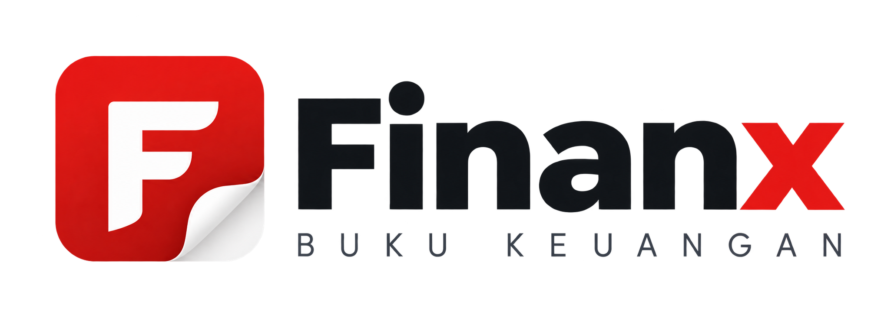

# Finanx — Buku Keuangan Pribadi



Aplikasi pencatat keuangan pribadi yang tenang dan sederhana. Catat pemasukan dan pengeluaran dalam hitungan detik, beri kategori pada setiap transaksi, dan pantau ringkasan bulanan beserta riwayat transaksi — tanpa akun, dompet, anggaran, atau kerumitan lain.

> **Tesis desain:** Uang adalah buku register yang kamu cap (stempel), bukan dashboard yang kamu amati. Setiap transaksi adalah satu baris dalam buku besar yang berjalan, dan mencatatnya adalah tekan stempel "LUNAS" — tindakan cepat dan tenang untuk menandai kebenaranmu sendiri.

## Fitur

- **Pencatatan cepat** — tambah pemasukan/pengeluaran via tombol FAB berbentuk stempel.
- **Transaksi** — buat, edit, dan hapus (soft delete) transaksi dengan jumlah, tanggal, tipe (income/expense), kategori, dan deskripsi opsional.
- **Dashboard bulanan** — ringkasan pemasukan, pengeluaran, dan saldo; visualisasi pemasukan vs pengeluaran; rincian per kategori; navigasi antar bulan.
- **Kategori** — kategori sistem bawaan per tipe + kategori kustom milik pengguna dengan ikon.
- **Profil** — foto, nama, email, dan logout.
- **Dua bahasa (i18n)** — Indonesia dan Inggris, dapat diganti langsung dari sidebar.
- **Responsif** — dioptimalkan untuk penggunaan seluler, tetap nyaman di tablet dan desktop.

## Tech Stack

- **React 18** + **Vite 6**
- **Supabase** (opsional — autentikasi Google + database Postgres dengan RLS)
- **localStorage** (mode demo, tanpa backend)
- Font: Inter + IBM Plex Mono

## Struktur Proyek

```
finanx/
├── src/
│   ├── components/     # UI (Dashboard, Transactions, Categories, Profile, dll.)
│   ├── lib/            # Store, i18n, format, icons, supabase client
│   ├── assets/         # Logo
│   ├── App.jsx         # Root component + context
│   ├── main.jsx        # Entry point
│   └── styles.css      # Semua styling
├── supabase/
│   └── schema.sql      # Skema database + RLS untuk mode cloud
├── scripts/            # Utility (screenshot, verify)
├── index.html
├── package.json
└── vite.config.js
```

## Cara Setup

### Prasyarat

- Node.js 18+ dan npm
- Opsional: akun [Supabase](https://supabase.com) untuk mode cloud

### Instalasi

```bash
# 1. Clone repository
git clone https://github.com/surega02/finanx.git
cd finanx

# 2. Install dependensi
npm install

# 3. Jalankan di mode pengembangan
npm run dev
```

Buka `http://localhost:5173` di browser.

> Catatan: secara default aplikasi berjalan dalam **mode demo** — data disimpan di `localStorage` dengan login Google simulasi dan data contoh. Tidak perlu konfigurasi apa pun untuk mencobanya.

### Mode Cloud (Supabase)

Untuk autentikasi Google asli + database cloud:

1. Buat proyek di [Supabase](https://supabase.com), catat **URL** dan **anon key**.
2. Jalankan isi `supabase/schema.sql` di SQL Editor proyek kamu.
3. Aktifkan provider **Google** di Authentication → Providers.
4. Buat file `.env` dari contoh dan isi kredensial:

   ```
   VITE_SUPABASE_URL=https://<your-project-ref>.supabase.co
   VITE_SUPABASE_ANON_KEY=<your-anon-key>
   ```

5. Restart dev server (`npm run dev`).

Panduan lengkap: lihat [`SUPABASE.md`](SUPABASE.md).

### Build Produksi

```bash
npm run build       # hasil di folder dist/
npm run preview     # pratinjau hasil build
```

## Cara Kerja Data

- **Mode demo:** semua data tersimpan di `localStorage` (key `finanx:v1`) dengan data contoh transaksi 30 hari terakhir.
- **Mode cloud:** setiap perubahan transaksi/kategori disinkronkan ke Supabase. Skema `supabase/schema.sql` menyediakan:
  - `profiles` — profil per pengguna (nama, email, foto, bahasa)
  - `categories` — kategori per pengguna dengan RLS
  - `transactions` — entri buku besar per pengguna dengan RLS
  - `ensure_system_categories(uid)` — seed kategori bawaan saat pengguna pertama kali masuk

## Fitur di Luar Cakupan (MVP)

Akun/wallet, transfer, anggaran, transaksi berulang, tujuan keuangan, utang, lampiran, ekspor, notifikasi, kolaborasi, dan pelaporan lanjutan sengaja tidak disertakan — agar tetap tenang dan sederhana.

## Dokumentasi Lain

- [`PRODUCT.md`](PRODUCT.md) — arah produk dan positioning
- [`DESIGN.md`](DESIGN.md) — kontrak arah desain ("The Stamped Register")
- [`SUPABASE.md`](SUPABASE.md) — panduan setup Supabase
- `Product Requirements Document — Personal Finance Tracker MVP.md` — kriteria fungsional dan penerimaan

## Lisensi

Privat — proyek internal.